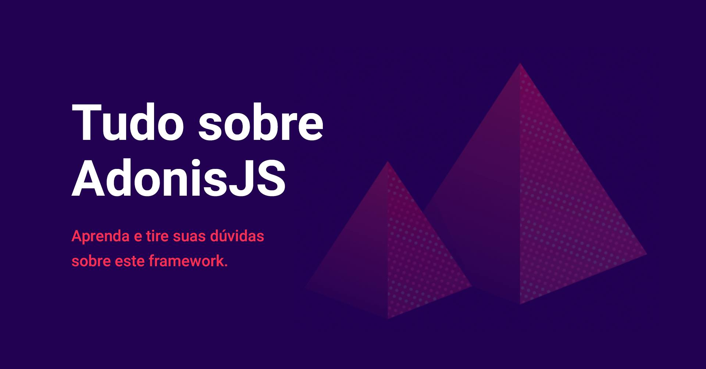

## Fórum

🗂 Fórum de discussões da comunidade AdonisJS Brasil. Contribua ;D

---

## Propósito

O fórum do AdonisJS Brasil aqui no github tem como objetivo melhorar a integração da comunidade com os conteúdos e discussões relacionados ao AdonisJS, nada melhor que uma plataforma de `devs` para falar sobre coisas de `devs`.

Os `issues` atuarão como o fórum em si e com eles será mais fácil organizar e consultar assuntos e discussões.

## Licença

[MIT](LICENSE) &copy; AdonisJS Brasil

## Mídias sociais

[Facebook](https://www.facebook.com/groups/adonisjsbrasil) 
[Instagram](https://www.instagram.com/adonisjsbrasil/) 
[Twitter](https://twitter.com/AdonisJSBrasil) 
[Discord](https://discord.gg/q37yU3E) 

## Outros

Fórum baseado no fórum da [Front-End Brasil](https://github.com/frontendbr)
